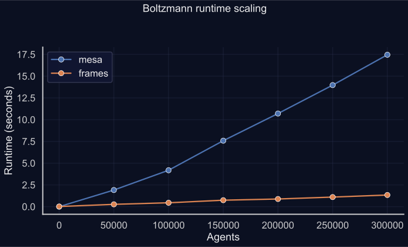

<!-- markdownlint-disable MD033 -->
<p align="center">
    
</p>

<h1 align="center">mesa-frames</h1>
<!-- markdownlint-enable MD033 -->

|         |                                                                                                                                                                                                                                                                                                                                                                                                                                                                                           |
| ------- | ----------------------------------------------------------------------------------------------------------------------------------------------------------------------------------------------------------------------------------------------------------------------------------------------------------------------------------------------------------------------------------------------------------------------------------------------------------------------------------------- |
| CI/CD   | [](https://github.com/mesa/mesa-frames/actions/workflows/build.yml) [](https://app.codecov.io/gh/mesa/mesa-frames)                                                                                                                     |
| Package | [](https://pypi.org/project/mesa-frames/) [](https://pypi.org/project/mesa-frames/) [](https://pypi.org/project/mesa-frames/) |
| Meta    | [](https://docs.astral.sh/ruff/) [](https://docs.astral.sh/ruff/formatter/) [](https://github.com/pypa/hatch) [](https://github.com/astral-sh/uv) |
| Chat    | [](https://matrix.to/#/#project-mesa:matrix.org)                                                                                                                                                                                                                                                                                                                                                      |

---

## Scale Mesa beyond its limits

Classic [Mesa](https://github.com/mesa/mesa) stores each agent as a Python object, which quickly becomes a bottleneck at scale.
**mesa-frames** reimagines agent storage using **Polars DataFrames**, so agents live in a columnar store rather than the Python heap.

You keep the Mesa-style `Model` / `AgentSet` structure, but updates are vectorized and memory-efficient.

### Why it matters

- ⚡ **10× faster** bulk updates on 10k+ agents ([see Benchmarks](#benchmarks))
- 📊 **Columnar execution** via [Polars](https://docs.pola.rs/): [SIMD](https://en.wikipedia.org/wiki/Single_instruction,_multiple_data) ops, multi-core support
- 🔄 **Declarative logic**: agent rules as transformations, not Python loops
- 🚀 **Roadmap**: Lazy queries and GPU support for even faster models

---

## Who is it for?

- Researchers needing to scale to **tens or hundreds of thousands of agents**
- Users whose agent logic can be written as **vectorized, set-based operations**

❌ **Not a good fit if:** your model depends on strict per-agent sequencing, complex non-vectorizable methods, or fine-grained identity tracking.

---

## Why DataFrames?

DataFrames enable SIMD and columnar operations that are far more efficient than Python loops.
mesa-frames currently uses **Polars** as its backend.

| Feature | mesa (classic) | mesa-frames |
| ------- | -------------- | ----------- |
| Storage | Python objects | Polars DataFrame |
| Updates | Loops | Vectorized ops |
| Memory overhead | High | Low |
| Max agents (practical) | ~10^3 | ~10^6+ |

---

## Benchmarks

[](https://github.com/mesa/mesa-frames/blob/main/benchmarks/README.md)

**mesa-frames consistently outperforms classic Mesa across both toy and canonical ABMs.**

In the Boltzmann model, it maintains near-constant runtimes even as agent count rises, achieving **up to 10× faster execution** at scale.

In the more computation-intensive Sugarscape model, **mesa-frames roughly halves total runtime**.

We still have room to optimize performance further (see [Roadmap](#roadmap)).

<!-- mkdocs-benchmark-plots-start -->



<!-- mkdocs-benchmark-plots-end -->

---

## Quick Start

[](/mesa-frames/tutorials/2_introductory_tutorial/)

1. **Install**

```bash
   pip install mesa-frames
```

Or for development:

```bash
git clone https://github.com/mesa/mesa-frames.git
cd mesa-frames
uv sync --all-extras
```

1. **Create a model**

   ```python
   from mesa_frames import AgentSet, Model
   import polars as pl

   class MoneyAgents(AgentSet):
       def __init__(self, n: int, model: Model):
           super().__init__(model)
           self += pl.DataFrame({"wealth": pl.ones(n, eager=True)})

       def give_money(self):
           self.select(self.wealth > 0)
           other_agents = self.df.sample(n=len(self.active_agents), with_replacement=True)
           self["active", "wealth"] -= 1
           new_wealth = other_agents.group_by("unique_id").len()
           self[new_wealth, "wealth"] += new_wealth["len"]

       def step(self):
           self.do("give_money")

   class MoneyModelDF(Model):
       def __init__(self, N: int):
           super().__init__()
           self.sets += MoneyAgents(N, self)

       def step(self):
           self.sets.do("step")
   ```

---

## Roadmap

> Community contributions welcome — see the [full roadmap](mesa-frames/roadmap)

- Transition to LazyFrames for optimization and GPU support
- Auto-vectorize existing Mesa models via decorator
- Increase possible Spaces (Network, Continuous...)
- Refine the API to align to Mesa

---

## License

Copyright © 2025 Adam Amer, Mesa team and contributors

Licensed under the [Apache License, Version 2.0](https://raw.githubusercontent.com/mesa/mesa-frames/refs/heads/main/LICENSE).
